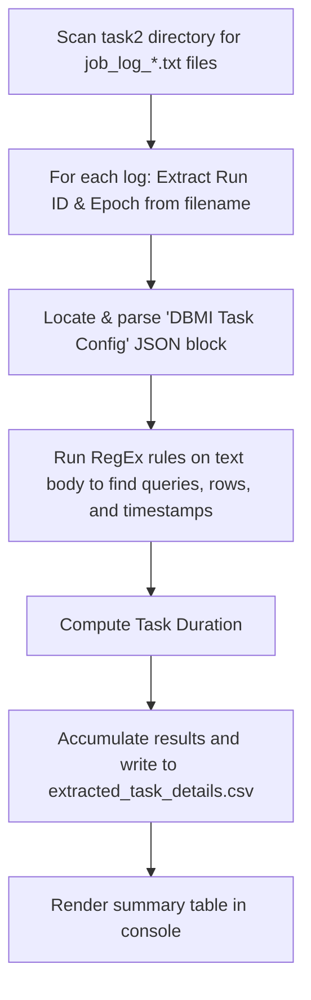

# Understanding the Log Extraction Script (analyze_logs.py)

This document provides a high-to-medium level explanation of the approach, design, and parsing logic used in [analyze_logs.py](file:///Users/sathishkumardm/Pikachooz2.0/notsoimp/task2/analyze_logs.py) to extract metadata from the IDMC Mass Ingestion logs.

---

## 1. High-Level Flow
The script executes in a sequential pipeline to process files and output results:

---

## 2. Parsing Approach (Medium-Level Details)

The script combines structured JSON parsing with unstructured Regex-based text searching to achieve high reliability and precision.

### Phase A: Parsing Structured Config Data (JSON)
Inside the log files, the secure agent dumps a complete JSON configuration defining the task parameters right after initialization. 
1. **Finding the JSON Anchor**: The script scans for the substring `DBMI Task Config is `.
2. **Brace-Matching Parser**: Because the log files contain raw lines directly following the JSON block, the script uses a character-by-character brace-matching loop:
   * Counts `{` (increments a counter) and `}` (decrements the counter).
   * Once the counter returns to `0`, it marks the precise end of the JSON object.
3. **Metadata Extraction**: The JSON is parsed using Python's built-in `json.loads()`. It extracts properties such as:
   * **Source Details**: Host, Database Vendor, Database Name, and Schema.
   * **Target Details**: Warehouse, Database, Staging stage name, Target Schema, Target Table, and Vendor.
   * **Task Identifiers**: `jobName`, `taskName`, and `runId`.

### Phase B: Extraction via Regular Expressions (Regex)
Unstructured runtime details (queries, rows, and timings) are parsed using regular expressions:

1. **Source SQL Query**: 
   * **Pattern**: `created Unload query <([^>]+)>`
   * **Purpose**: Grabs the exact SQL query run on Microsoft SQL Server. If JSON configuration is incomplete, a fallback regex maps the `FROM [<db>].[<schema>].[<table>]` clause to discover the database structures.
2. **Target SQL Copy Query**: 
   * **Pattern**: `Executing query:\s*(COPY INTO\s+.*?;)`
   * **Purpose**: Extracts the Snowflake `COPY INTO` command, capturing columns, files staged, and staging format specifications.
3. **Record / Row Count**: 
   * **Pattern 1**: `Number of records read: (\d+)` (primary matching target)
   * **Pattern 2**: `Inserts: (\d+)` (fallback checking target)
   * **Purpose**: Determines how many data rows were read and processed.
4. **Filename Tokens**: 
   * **Pattern**: `job_log_(\d+)_(\d+)\.txt`
   * **Purpose**: Decodes the task's unique `Run ID` and the file's generation epoch time.

### Phase C: Time & Performance Metrics
* **Log Timestamps**: The script scans the start of each line for the standard log timestamp format: `^\d{4}-\d{2}-\d{2}\s+\d{2}:\d{2}:\d{2},\d{3}`.
* **Start & End Time**: The first matching timestamp in the file represents the task's initialization start, and the last matching timestamp represents the completion event.
* **Duration Calculation**: The timestamps are parsed into `datetime` objects using `datetime.strptime(..., "%Y-%m-%d %H:%M:%S,%f")`. The script computes the total run duration via subtraction: `(t_end - t_start).total_seconds()`.

---

## 3. CSV Schema & Writing
The script utilizes Python's built-in `csv.DictWriter` to ensure CSV compliance (e.g. auto-escaping double quotes in SQL queries):
* **Output Path**: [extracted_task_details.csv](file:///Users/sathishkumardm/Pikachooz2.0/notsoimp/task2/extracted_task_details.csv)
* **Columns**: 
  1. `Log_File`
  2. `Run_ID`
  3. `Job_Name`
  4. `Task_Name`
  5. `Source_Vendor`
  6. `Source_Host`
  7. `Source_DB`
  8. `Source_Schema`
  9. `Source_Table`
  10. `Source_Query`
  11. `Target_Vendor`
  12. `Target_Host`
  13. `Target_DB`
  14. `Target_Schema`
  15. `Target_Table`
  16. `Target_Query`
  17. `Count_of_Rows`
  18. `Start_Time`
  19. `End_Time`
  20. `Duration_Secs`
